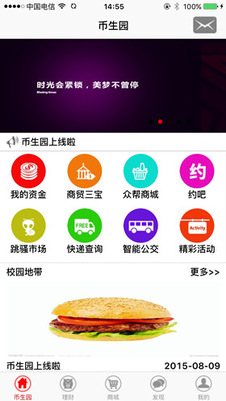
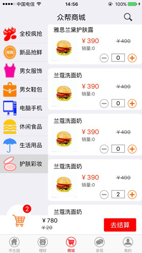
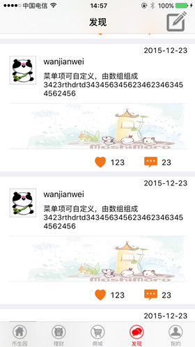
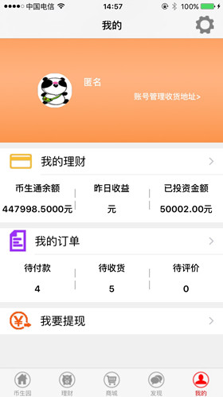
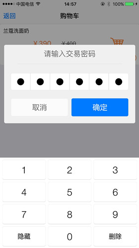

# bsy0720   
一款针对以在校大学生购物及理财的iOS app，该app实际上是本人做的的一个外包项目，主要的工作是负责iOS客户端第一版的开发。   

### APP截图  

> 
>    
> 
>    
>    

### 工作总结   
项目整体上并没有什么难度，但是收获还是有很多的。比如webKit的使用，tableView的上拉加载和下拉刷新，广告轮播视图的原理等。此外，该app还涉及到大量的图片浏览，正好促使我去学习了下图片的缓存机制。